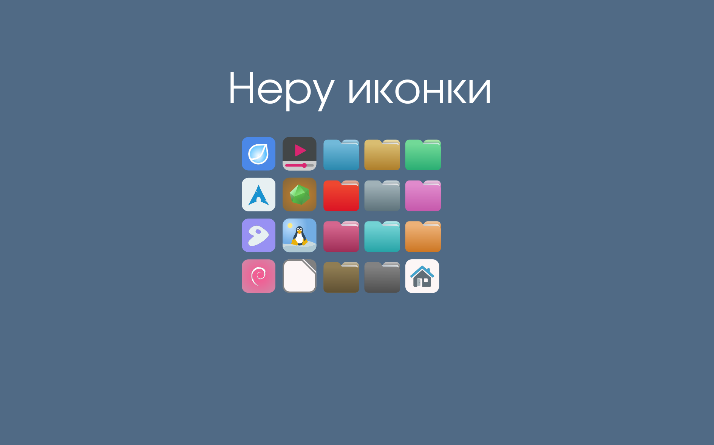

neru-icon-classic-theme
=======================

* Тема иконок Неру Версия 2.8
* Theme icons Neru Version 2.8

## Изображение / Image

## Особенности

* Более 3000 иконок
* Подходит для разных окружений KDE4, KDE5 Plasma, Xfce, Gnome, LXQT, Мате и т.д.
* Для тёмных и светлых тем

## Features

* More than 3000 icons
* Suitable for different environments KDE4, KDE5 Plasma, Xfce, Gnome, LXQT, Mate, etc.
* For dark and light themes

## Установка / Installation

`git clone https://github.com/basigur/neru-icon-classic-theme.git && cd neru-icon-classic-theme && cp -r neru-classic-* ~/.local/share/icons/`

## Сообщество / Community
* РОСПО Дизайн-студия
* ROSPO Design Studio
* https://vk.com/rospodesign

